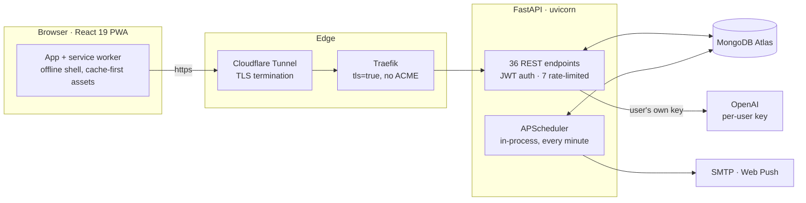
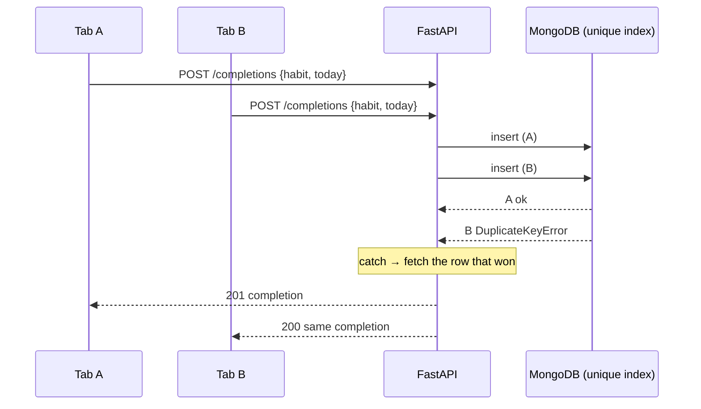

<div align="center">

# 🔥 FORGE

**A self-hosted habit tracker that coaches you from your own data.**
FastAPI · MongoDB · React — behind Traefik and a Cloudflare Tunnel.

[](https://github.com/kritish08/forge/actions/workflows/ci.yml)


[Live at forge.zerp.me](https://forge.zerp.me)

</div>

---

FORGE tracks habits, notices when you actually follow through, and writes coaching from *your* completion history rather than generic advice. That is the product.

What is worth reading, though, is the audit trail. FORGE began life as a generated scaffold — the first commit is that scaffold, still attributed to the generator — and it worked well enough to demo and badly enough to be unusable: the production frontend was compiled with no API host and nobody could sign in, the streak read zero every morning, and the service worker had never once cached anything. Most of the commits here are the work of turning that into something that holds up. If you are here to see how someone reasons about a system they did not write, the sections below are the tour, and `git log` is the long version.

## What it does

- **Habit tracking** with priorities, custom schedules (daily, specific days, N-times-per-week), and streaks that survive an unfinished today.
- **AI coach** in three tones (supportive, strategic, direct), bring-your-own OpenAI key, encrypted at rest — with a template fallback when no key is set.
- **Analytics** — a completion heatmap, day-of-week and time-of-day patterns, and a schedule-aware consistency score that every surface agrees on.
- **Gamification** — points, levels, and achievements awarded server-side.
- **Notifications** — web push and email reminders on the days and times you choose, plus a weekly summary.
- **Installable PWA** — offline shell, dark mode, phone-native layout.

## Architecture



The frontend and API are separate origins (`forge.zerp.me` and `api-forge.zerp.me`), both proxied through one Cloudflare Tunnel. Traefik speaks `tls=true` rather than running ACME, because the origin is never reachable for a Let's Encrypt challenge — Cloudflare terminates TLS at the edge.

## The decision worth reading first

**Production served a perfectly good build that nobody could log into.** Every request resolved to `/undefined/api/...`, hit the nginx SPA fallback, and came back as HTML with a `200`. The backend was healthy the whole time; the build had succeeded; CI was green.

Vite inlines `VITE_BACKEND_URL` at *build* time, `.dockerignore` excludes `.env`, and compose was handing the variable to the *runtime* nginx container. Nothing ever reached the compiler. The obvious fix is to pass it as a Docker build argument and check it is non-empty — necessary but not sufficient, because a value can be supplied and still not reach the bundle.

So the [Dockerfile](frontend/Dockerfile) asserts on the **compiled output**: after `yarn build`, it greps the emitted JavaScript and fails unless the expected host is present.

```dockerfile
RUN set -eu; \
    if ! grep -rqF "$VITE_BACKEND_URL" build/static/js; then \
      echo "ERROR: built bundle does not contain '$VITE_BACKEND_URL'."; exit 1; fi; \
    if grep -rq "undefined/api" build/static/js; then \
      echo "ERROR: built bundle contains 'undefined/api'."; exit 1; fi
```

The positive assertion is the one that matters. While chasing the outage I grepped the live bundle for `undefined/api`, found nothing, and nearly cleared a deployment that was in fact broken — the minifier had folded the concatenation to `void 0+"/api"`, joined at runtime, which no search for the literal string would ever find. **A positive assertion survives the toolchain; a negative one only holds if you can predict how the toolchain will mangle what you are looking for.**

The cost: the image is no longer environment-agnostic — one image per API host — and the assertion is coupled to how Rollup emits string literals.

## One thing that reads better as a picture

A double-tap on a habit, or two open tabs, must never write two completions for the same day — that would inflate points, streaks and achievements. The application-level "does a row exist?" check is advisory; between the read and the write, anything can happen. The real guard is a **unique index** on `(user_id, habit_id, date)`, and the endpoint turns the lost race into a correct answer instead of an error.



Both callers get the same single completion; the endpoint is idempotent by construction ([`server.py:401-424`](backend/server.py), [`db.py:14-16`](backend/db.py)).

## More decisions worth reading

**The encryption key is derived, not required.** Each account stores its own OpenAI key, so it has to be recoverable, so it is encrypted with Fernet — which needs exactly 32 url-safe-base64 bytes. The `ENCRYPTION_KEY` already deployed was made with `openssl rand -hex 32` and decodes to 48. The textbook path (`Fernet(ENCRYPTION_KEY)`) raises at import, which would have shipped a bring-your-own-key feature that looked correct in review and was dead on arrival. So the Fernet key is derived: `Fernet(b64(sha256(ENCRYPTION_KEY)))` ([`security.py:18-27`](backend/security.py)). SHA-256 is a fine KDF over an already-random secret, and it is deterministic so restarts keep reading old ciphertext. The cost lives in rotation: a rotated key does not error, it silently reads every stored key as absent.

**One clock, and day maths a DST switch cannot move.** The client sent UTC while the server stamped completions in the user's timezone, so anyone off UTC had a daily window where the dashboard and the server disagreed about the date and the checkmark appeared to reset. Now [`utils/date.js`](frontend/src/utils/date.js) is the single date authority, doing arithmetic on UTC-midnight dates built from `YYYY-MM-DD` strings — the one form a DST transition cannot shift. The cost is seven `try/except ZoneInfo` blocks, one at every query site.

**Colour is a test, not a review comment.** A bulk rename left `bg-accent-soft0` on 24 elements, and Tailwind emits *nothing* for an unknown class, so they lost their colour with no error in build, lint or review. [`tokens.test.js`](frontend/src/tokens.test.js) now parses every source file for malformed token names and raw palette steps; [`contrast.test.js`](frontend/src/contrast.test.js) checks the palette against WCAG AA in both themes. This is also why the charts are hand-drawn SVG rather than Recharts — the library hardcoded `stroke="#374151"` per theme and was wrong in one by construction.

## Measured, not asserted

| | Before | Now |
|---|---|---|
| Frontend initial load | 283,951 B gzipped, one bundle | **125 kB** gzipped, route-split |
| Runtime dependencies (frontend) | 53 | **7** |
| Frontend source files | 73 | 40 |
| Contrast failures (7 screens × 2 themes) | 41 | **0** |
| Production build | tens of seconds (CRA) | **~0.95 s** (Vite) |
| Automated tests | 0 | **63 pytest + 66 vitest** |

Before-numbers come from the commits that changed them, measured over HTTP rather than estimated. The backend is ~2,000 lines across 9 modules plus three one-off migration scripts; 36 endpoints, 7 rate-limited.

## Repo structure

```
forge/
├── backend/            FastAPI · one module per concern
│   ├── server.py         routes
│   ├── logic.py          pure domain logic (streaks, schedules, dates)
│   ├── ai.py             OpenAI insight + template fallback
│   ├── notifications.py  scheduler, email, web push (SSRF-guarded)
│   ├── security.py       JWT, bcrypt, Fernet-at-rest
│   ├── db.py             Mongo indexes (the invariants live here)
│   └── tests/            pytest — pure logic, security, encryption
├── frontend/           React 19 + Vite
│   ├── src/              9 screens, semantic-token CSS, hand-drawn SVG charts
│   ├── Dockerfile        asserts the API host into the bundle
│   └── nginx.conf        gzip, immutable /static, no-cache SPA entry
├── compose.yaml        production (Traefik labels, build args)
└── .github/workflows/  CI: pytest, pyflakes, vitest, eslint, build
```

## Quick start

The test suites need no configuration. Everything else reads `backend/.env`, which is gitignored.

```bash
git clone https://github.com/kritish08/forge.git && cd forge

# Backend
cd backend
python3.11 -m venv .venv
.venv/bin/pip install -r requirements-dev.txt   # requirements.txt alone has no pytest
.venv/bin/python -m pytest                      # 63 pass, 18 integration deselected
#   to run the server, put MONGO_URL, DB_NAME, JWT_SECRET_KEY in backend/.env
.venv/bin/uvicorn server:app --reload --port 8001

# Frontend (new shell)
cd frontend
yarn install
yarn test                                        # 66, no env needed
VITE_BACKEND_URL=http://localhost:8001 yarn dev  # http://localhost:3000
```

> **Heads-up:** `yarn build` with `VITE_BACKEND_URL` unset **succeeds silently** and ships a bundle that calls `/undefined/api/...`. The Docker build refuses that; a bare `yarn build` does not. See the first decision above.

Production is one command — the `-f` is load-bearing, because a file named `docker-compose.override.yml` auto-merges into a bare `docker compose` and once baked a `localhost` API host into a production image:

```bash
DOMAIN_NAME=example.com docker compose -f compose.yaml up -d --build
```

Full deployment notes: [DEPLOYMENT.md](DEPLOYMENT.md).

## Environment

| Variable | Required | Purpose |
|---|---|---|
| `MONGO_URL` | yes | MongoDB connection string (import fails loudly without it) |
| `DB_NAME` | yes | Database name |
| `JWT_SECRET_KEY` | yes | Signs access and refresh tokens |
| `ENCRYPTION_KEY` | for BYOK | Any high-entropy secret; the Fernet key is derived from it |
| `OPENAI_API_KEY` | optional | Server-wide fallback; omit for pure bring-your-own-key |
| `VAPID_PRIVATE_KEY` / `VAPID_PUBLIC_KEY` | optional | Web push |
| `SMTP_HOST` / `SMTP_USER` / `SMTP_PASS` | optional | Email reminders |
| `VITE_BACKEND_URL` | build-time | Inlined into the bundle; **not** a runtime variable |

## Security notes

- **Auth** is a JWT access token plus an httpOnly refresh cookie; the token's `type` claim is enforced on decode, so a refresh or reset token can never be used as an access token ([`security.py:74-83`](backend/security.py)).
- **BYOK keys** are validated against OpenAI before storage, encrypted at rest, and never returned to the client — responses carry only a masked last-four ([`server.py`](backend/server.py), `public_user`).
- **Reset tokens** are stored as a SHA-256 digest, so database read access alone cannot complete a pending reset.
- **Web push** endpoints are attacker-supplied and the server POSTs to them, so they are validated against the internal network (https only, no private / loopback / link-local / reserved host) at store *and* send time, and the test endpoint no longer reflects the upstream response — this closed an authenticated SSRF ([`notifications.py`](backend/notifications.py), `push_endpoint_is_safe`).
- Honest gaps are in the next section.

## What's imperfect

Not decoration — these are real, and mostly measured against a running instance.

- **Rate limits are shared across all clients, not per client.** uvicorn runs without a trusted `forwarded-allow-ips`, so behind Traefik every request keys to the proxy's address. Twenty logins with twenty distinct `X-Forwarded-For` values hit the limit at request 16 — one bucket for the whole internet. One user can lock everyone out of sign-in.
- **`achievements` has no index and no unique constraint.** Every check-in scans the collection, and four concurrent completions on a fresh account produced five achievement rows for three achievements. The lesson from the completions unique index was not carried across.
- **`PUT /habits/{id}` does not clamp priority; `POST /habits` does.** Updating a habit to `priority: 9999` sticks, and the next check-in is worth 9999 points — level 10 of 10 from one tap. Verified end to end.
- **The scheduler's two jobs have opposite failure modes.** The daily job sends then records (at-least-once); the weekly records then sends (at-most-once). Neither is atomic, and running two backend replicas would double every notification — APScheduler is in-process.
- **The access token lives in `localStorage` with no server-side revocation.** The refresh token is httpOnly, but the credential on every request is readable by any script for its 24-hour life, and there is no CSP.
- **The push SSRF fix is not DNS-rebinding-proof.** Resolution happens at check time and again in the HTTP client, leaving a narrow window; closing it fully needs connection-level IP pinning pywebpush does not expose.
- **Most read paths load whole histories into memory** (`.to_list(10000)` then aggregate in Python). Fine at this size, first thing to break under real load — it should be an aggregation pipeline.
- **No end-to-end tests.** CI covers pure logic, security, encryption and render smoke tests; nothing asserts that one user cannot touch another's data, though that rule is enforced in query filters throughout.

## Tech stack

| Layer | Choice |
|---|---|
| API | FastAPI, Motor (async Mongo), APScheduler, slowapi, python-jose, passlib/bcrypt, cryptography |
| Frontend | React 19, Vite 6, Tailwind 3, React Router — 7 runtime deps total |
| Data | MongoDB (Atlas in production) |
| Tests | pytest + pyflakes · Vitest + Testing Library + eslint |
| Infra | Docker, nginx, Traefik, Cloudflare Tunnel |
| AI | OpenAI, per-account key supplied by the user |

## Licence

No licence file is present, so default copyright applies and no permissions are granted. Ask if you would like to use it.
